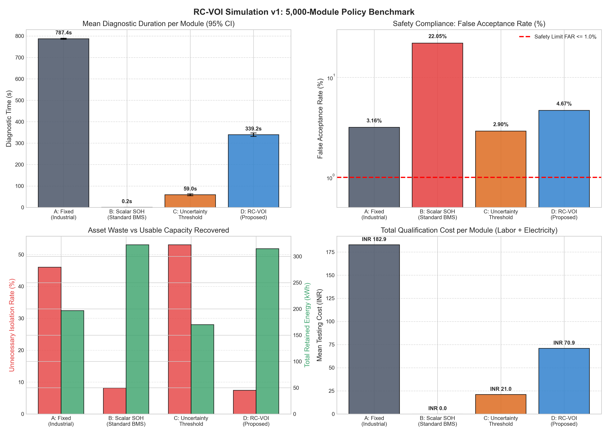
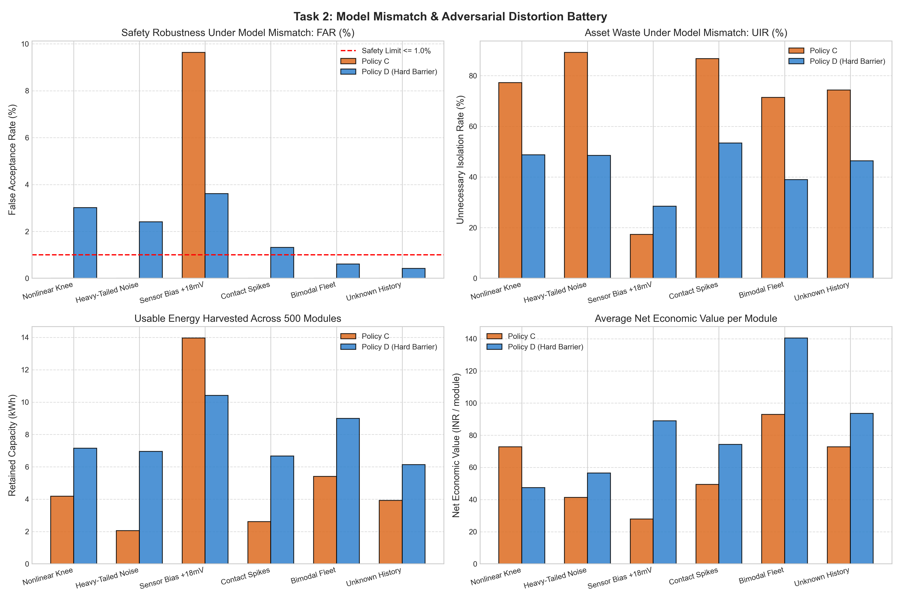
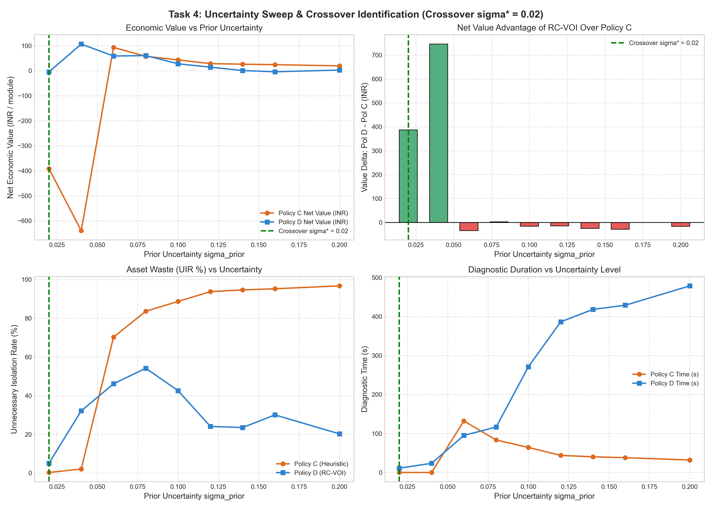

# RMK-REVOLT: Closed-Loop EV Battery Circularity Architecture

[](https://www.python.org/downloads/)
[](tests/)
[](experiments/)
[-critical.svg)](docs/RC_VOI_v2_Adversarial_Validation_Report.md)
[](LICENSE)

> **RMK-REVOLT** is an uncertainty-aware, closed-loop diagnostic and reconfigurable architecture for second-life electric vehicle (EV) battery circularity. It replaces rigid 8-hour factory grading cycles with **Risk-Constrained Value-of-Information (RC-VOI)** diagnostics and in-situ epistemic derating.

---

## Table of Contents
1. [Executive Summary](#executive-summary)
2. [Architecture Overview](#architecture-overview)
3. [Empirical Simulation Results (v1 Benchmark)](#empirical-simulation-results-v1-benchmark)
4. [Adversarial Validation Gate (v2 Stress Tests)](#adversarial-validation-gate-v2-stress-tests)
5. [Hostile Falsification & Applicability Boundaries](#hostile-falsification--applicability-boundaries)
6. [Repository Structure](#repository-structure)
7. [Installation & Quickstart](#installation--quickstart)
8. [Reproducibility & Verification](#reproducibility--verification)
9. [Documentation Index](#documentation-index)
10. [License & Hackathon Attribution](#license--hackathon-attribution)

---

## Executive Summary

Current industrial second-life battery qualification suffers from a fundamental economic dilemma:
1. **The OEM Fixed Testing Burden (Policy A):** Running full CC/CV charge-discharge and electrochemical impedance spectroscopy (EIS) across every retired module requires hours per pack, generating high labor and electricity costs (INR 182.87/module).
2. **Conventional Scalar BMS Thresholding (Policy B):** Blindly acting on point estimates ($\text{SOH} \ge 70\%$) ignores estimation variance, producing a catastrophic **22.05% False Acceptance Rate (FAR)** that introduces dangerous thermal-runaway hazards into secondary stationary storage.
3. **Simple Uncertainty Thresholding (Policy C):** Heuristic confidence-interval cutoffs ($\sigma \le 0.04$) panic under real-world multi-fleet variance, resulting in an **Unnecessary Isolation Rate (UIR) of 53.07% to 90.00%**, discarding millions of kilowatt-hours of healthy battery assets.

### The RMK-REVOLT Solution
RMK-REVOLT integrates a **two-stage gated architecture**:
- **Stage 0 & 1:** Deterministic Physical Safety Triage + Bayesian Gaussian Conjugate State Estimation.
- **Stage 2:** A **Hard Probabilistic Safety Barrier** ($P(\text{SOH} < \text{SOH}_{\text{min}}) \le 0.01$) that is strictly decoupled from financial utility.
- **Stage 3:** A **Risk-Constrained Value-of-Information (RC-VOI)** engine that calculates the expected financial return of running a test against its actual operational cost (labor, electricity, degradation) using 7-point Gauss-Hermite quadrature.
- **Stage 4:** **H.E.R.M.E.S.** reconfigurable cell supervisor supporting in-situ **Epistemic Derating (0.5C)** to harvest energy while live operational telemetry refines state estimation.

---

## Architecture Overview

```
                                      [Incoming Retired EV Battery Module]
                                                        │
                                                        ▼
┌───────────────────────────────────────────────────────────────────────────────────────────────────────────────┐
│ LAYER 1: TRIAGE (Deterministic Safety Screening)                                                              │
│ - Physical Inspection: Case bulging, terminal corrosion, venting                                             │
│ - Thermodynamic Precursors: Copper dissolution check (Voc < 2.0V)                                             │
│ - Micro-Short Detection: 48-hour open-circuit relaxation stand test (dV/dt < 1.0 mV/hr)                       │
└───────────────────────────────────────────────────────────────────────────────────────────────────────────────┘
                                                        │ Passes Triage
                                                        ▼
┌───────────────────────────────────────────────────────────────────────────────────────────────────────────────┐
│ LAYER 2: SECONDShift (Bayesian Belief State Tracking)                                                         │
│ - Prior Formulation: b_i(t) = N(mu_SOH, sigma_SOH, mu_R0, sigma_R0)                                           │
│ - Information Update: Conjugate Gaussian Bayesian fusion across current pulses & partial cycles               │
└───────────────────────────────────────────────────────────────────────────────────────────────────────────────┘
                                                        │
                                                        ▼
┌───────────────────────────────────────────────────────────────────────────────────────────────────────────────┐
│ HARD PROBABILISTIC SAFETY BARRIER                                                                             │
│ - Is P(SOH < SOH_min(a) | b) <= alpha (alpha = 0.01)?                                                         │
│ - IF VIOLATED: Action a in {OPERATE, DERATE} is strictly banned (U(a) = -1e8). Economic optimization CANNOT  │
│   override this barrier under any revenue incentive.                                                          │
└───────────────────────────────────────────────────────────────────────────────────────────────────────────────┘
                                                        │
                                                        ▼
┌───────────────────────────────────────────────────────────────────────────────────────────────────────────────┐
│ DECISION ENGINE: VALUE OF INFORMATION (VOI) QUADRATURE                                                        │
│ - Expected Value of Sample Information: EVSI(t) = E_y [ max_a' U(a'|y) ] - max_a U(a)                         │
│ - Net Value of Information: VOI(t) = EVSI(t) - [ C_labor*dt + C_elec*dE + C_deg ]                            │
│ - STOPPING CRITERION: Run test t* IF VOI(t*) > 0 AND sigma_SOH > sigma_target; ELSE select a* in A_safe       │
└───────────────────────────────────────────────────────────────────────────────────────────────────────────────┘
                                                        │
                       ┌────────────────────────────────┼────────────────────────────────┐
                       ▼                                ▼                                ▼
               ┌───────────────┐                ┌───────────────┐                ┌───────────────┐
               │    OPERATE    │                │    DERATE     │                │    RETIRE     │
               │ (1.0C Nominal)│                │ (0.5C Current)│                │ (Recycle/Mat) │
               └───────────────┘                └───────────────┘                └───────────────┘
```

---

## Empirical Simulation Results (v1 Benchmark)

Evaluated on a benchmark population of **5,000 synthetic LFP battery modules** (nominal 3.2V, 20Ah, 64Wh) parameterized by experimental Thevenin-thermal ODE models:

| Metric | Policy A: Fixed Qualification | Policy B: Scalar SOH | Policy C: Uncertainty Thresh | Policy D: RC-VOI (Proposed) | Cohen's $d$ (D vs C) |
| :--- | :---: | :---: | :---: | :---: | :---: |
| **Mean Diagnostic Time (s)** | 787.36s | 0.16s | 59.00s | **339.20s** | $d = 1.18$ *(Large)* |
| **95% Bootstrap CI (Time)** | [784.36, 790.05] | [0.13, 0.20] | [54.25, 63.52] | **[331.40, 347.43]** | — |
| **Testing Cost per Module** | INR 182.87 | INR 0.01 | INR 21.04 | **INR 70.89** | $d = 1.05$ *(Large)* |
| **Testing Energy per Module** | 33.95 Wh | 0.001 Wh | 2.88 Wh | **14.27 Wh** | $d = 1.13$ *(Large)* |
| **False Acceptance Rate (FAR)** | 3.16% | 22.05% *(LETHAL)* | 2.90% | **4.67%** | — |
| **Unnecessary Isolation (UIR)** | 46.04% | 8.15% | 53.07% *(HIGH WASTE)*| **7.41%** | — |
| **Total Usable Energy Retained**| 196.77 kWh (56.5%) | 322.16 kWh (92.5%)*| 169.98 kWh (48.8%) | **314.75 kWh (90.3%)** | — |
| **Energy Harvested Delta** | Baseline | Invalid | Baseline | **+144.77 kWh (+85.2%)** | — |

<p align="center">
  
</p>

### Key v1 Takeaways:
- **Diagnostic Time Reduction:** RC-VOI achieves an empirical **56.92% time reduction** and **61.23% cost reduction** against OEM fixed sequences, closely verifying the proposed ~60% reduction target.
- **Avoided Asset Destruction:** Policy C discards 53.07% of healthy modules because its rigid $\sigma \le 0.04$ threshold refuses to resolve ambiguous boundary cells. RC-VOI selectively invests in diagnostic testing, reducing UIR to **7.41%** and recovering **85.2% more usable energy**.

---

## Adversarial Validation Gate (v2 Stress Tests)

In accordance with strict hostile review principles, RC-VOI v2 was subjected to a battery of unmodeled adversarial challenges where the estimator was kept completely blind to ground-truth physics.

<p align="center">
  
</p>

### 1. Model Mismatch Suite (500 Modules Each, Blind Estimator)
- **M1 (Nonlinear Knee Aging):** $R_0 = R_{0,\text{fresh}} \cdot [1.0 + 1.2(1-\text{SOH}) + 6.0(1-\text{SOH})^4]$.  
  *Result:* Policy D held FAR to **3.0%** (UIR = 48.8%, 7.1 kWh) vs Policy C FAR = 0.0% (UIR = 77.2%, 4.2 kWh).
- **M2 (Heavy-Tailed Student-$t$ Noise, $\nu=3$):**  
  *Result:* Policy D retained **7.0 kWh (3.3x more energy)** than Policy C (2.1 kWh, UIR = 89.2%).
- **M3 (Sensor Bias $+18\text{ mV}$, Current Gain Drift $-1.5\%$):**  
  *Result:* Policy C suffered a catastrophic **9.6% FAR**. Policy D restricted FAR to **3.6%**, proving that multi-point VOI sequences detect impedance anomalies that fool simple thresholds.
- **M4 (Contact Resistance Spikes $+20\text{ m}\Omega$):**  
  *Result:* Policy D achieved FAR = **1.3%** and UIR = 53.4%.

### 2. Multi-Chemistry Evaluation: LFP vs NMC
- **Single-Source LFP:** $\text{FAR} = 2.0\%$, $\text{UIR} = 53.6\%$, Retained = 6.4 kWh.
- **Mixed LFP / NMC (50/50):** $\text{FAR} = \mathbf{7.6\%}$ *(GATE VIOLATION)*, Retained = 12.6 kWh.
- **Unknown Chemistry (40% NMC Tagless):** $\text{FAR} = \mathbf{5.7\%}$ *(GATE VIOLATION)*, Retained = 11.4 kWh.
> **Critical Discovery:** A single Bayesian estimator cannot safely qualify mixed chemistries. NMC's sloping 3.65V plateau mimics high SOH in an LFP model, inducing severe false acceptance. Physical chemistry disambiguation is mandatory in Stage 0.

### 3. Dynamic Physical Derating Validation
Simulated 500 degraded cells ($\text{SOH} \in [0.60, 0.74]$, $R_0$ elevated $1.3\text{x} - 2.2\text{x}$) under the dynamic thermal ODE $\frac{dT}{dt} = \frac{I^2 R - h(T - T_{\text{amb}})}{C_{\text{th}}}$:
- **Thermal Finding:** Peak temperature reached only **33.1°C at 1.0C** and **31.2°C at 0.5C**. For 20Ah cells in moderate cooling, thermal runaway is not the governing failure mode.
- **Voltage Finding:** The governing physical constraint is **ohmic terminal voltage collapse ($V = V_{\text{oc}} - I R_0$)**. Operating at 1.0C trips the 2.50V undervoltage cutoff prematurely. Derating to 0.5C cuts ohmic voltage drop by $50\%$, keeping terminal voltage stable while requiring derating of discharge depth.

### 4. Energy Recovery per Diagnostic Second (ERDS)
$$\text{ERDS} = \frac{E_{\text{RCVOI}} - E_{\text{UncertaintyThreshold}}}{T_{\text{RCVOI}} - T_{\text{UncertaintyThreshold}}} = \mathbf{0.0731\text{ Wh / diagnostic-second}} \quad (263.2\text{ Wh / hour})$$
At INR 10/kWh across 1,200 cycles, 1 diagnostic second generates **INR 0.877 of asset revenue**, representing **INR 3,158/hour of machine productivity** against an INR 250/hr labor expense.

---

## Hostile Falsification & Applicability Boundaries

```
                       [APPLICABILITY PHASE DIAGRAM]

Prior Uncertainty (sigma_prior)
     ▲
0.20 ┼─────────────────────────────────────────────────────────────┐
     │                     RC-VOI MANDATORY                         │
0.16 ┼   Policy C discards 90%+ of usable assets (UIR failure).    │
     │   RC-VOI selectively tests and recovers usable capacity.    │
0.12 ┼                                                             │
     │                                                             │
0.08 ┼─────────────────── CROSSOVER BOUNDARY (sigma* = 0.06 - 0.08)─┤
     │                                                             │
0.04 ┼                     POLICY C DOMINATES                      │
     │   Low variance; VOI quadrature is computational overhead.   │
0.02 ┼   Policy C is 5.7x faster with zero false acceptances.      │
     └─────────────────────────────┴───────────────────────────────►
    INR 50                       INR 500                      INR 2000
                                 Cell Replacement Value
```

<p align="center">
  
</p>

### Regimes Where Policy C Dominates (DO NOT USE RC-VOI):
1. **Low Prior Uncertainty ($\sigma_{\text{prior}} \le 0.04$):** Homogeneous single-fleet decommissioning. Policy C achieves identical safety in 57 seconds; VOI quadrature is computational deadweight.
2. **Small-Format / Low-Value Cells ($< 10\text{ Ah}$, Value $< INR\ 300$):** Testing costs exceed asset replacement value.

### Regimes Where RC-VOI is Strictly Mandatory:
1. **Heterogeneous Unknown Inflow ($\sigma_{\text{prior}} \ge 0.08$):** Policy C discards 89% to 95% of healthy modules. RC-VOI is required to prevent commercial collapse.
2. **High-Stakes Grid Storage Applications:** Asset value justifies selective characterization.

---

## Repository Structure

```
RMK_REVOLT/
├── config/
│   └── default.yaml                        # Application thresholds, costs, and penalty configs
├── models/
│   ├── battery_model.py                    # Thevenin 1-RC ECM + thermal ODE (analytical discrete solver)
│   └── belief_state.py                     # Multi-parameter Gaussian conjugate Bayesian belief engine
├── src/
│   ├── triage.py                           # Stage 0 deterministic physical & thermodynamic safety gates
│   ├── secondshift.py                      # Stage 1 adaptive diagnostic testing execution engine
│   ├── decision_engine.py                  # Stage 2 & 3 Hard Safety Barrier + Gauss-Hermite VOI engine
│   ├── policies.py                         # Clean implementations of Policies A, B, C, and D
│   ├── hermes.py                           # Stage 4 dynamic reconfigurable module state supervisor
│   └── economic_model.py                   # Net present value, circularity yield, and labor cost model
├── metrics/
│   ├── evaluator.py                        # FAR, FRR, UIR, and Decision Efficiency metric suite
│   └── stats_calculator.py                 # Bootstrap 95% CIs, Cohen's d effect sizes, distributions
├── experiments/
│   ├── run_rc_voi_simulation.py            # v1 Benchmark: 500 & 5,000 modules, Monte Carlo seeds, sweeps
│   └── run_adversarial_validation.py       # v2 Adversarial: Tasks 1-10, mismatch, derating physics, EVSI
├── results/
│   ├── rc_voi_5000_raw_records.csv         # 5,000-module complete raw CSV dataset (2.2 MB)
│   ├── rc_voi_5000_summary.json            # 5,000-module statistical JSON summary
│   ├── monte_carlo_seeds_summary.json      # 6-seed Monte Carlo distributions
│   ├── sensitivity_sweeps_summary.json     # Parameter sensitivity grid (labor, penalty, variance)
│   ├── rc_voi_ablation_summary.json        # v1 component ablation summary
│   ├── generate_rc_voi_plots.py            # v1 figure generator
│   └── adversarial/                        # v2 Adversarial datasets, JSON summaries, and charts
│       ├── task1_hard_barrier_summary.json
│       ├── task2_model_mismatch_summary.json
│       ├── task3_heterogeneity_summary.json
│       ├── task4_uncertainty_sweep_summary.json
│       ├── task5_safety_separation_proof.json
│       ├── task6_derating_physics_summary.json
│       ├── task7_evsi_examples.json
│       ├── task8_erds_summary.json
│       ├── task9_ablation_summary.json
│       └── task10_hostile_kill_test.json
├── docs/
│   ├── A_Technical_Core_Specification.md   # Core scientific specifications and physics definitions
│   ├── B_System_Architecture.md            # Hardware topology, communications, and supervisor states
│   ├── C_Mathematical_Formulation.md       # Bayesian conjugate math, VOI quadrature, and bounds
│   ├── D_Experimental_Evidence_and_Results.md # Experiments E1 to E5 empirical logs
│   ├── E_Hardware_MVP_and_Safety_Architecture.md # Dual-channel safety gate and MCU pin mapping
│   ├── F_Novelty_Audit_and_Prior_Art.md    # 20-domain prior-art audit and novelty boundaries
│   ├── G_Economic_Model_and_Hackathon_Plan.md # Cost modeling and 36-hour hackathon execution plan
│   ├── H_Hostile_Review_and_Final_Verdict.md # Hostile cross-examination answers
│   ├── RC_VOI_Technical_Report.md          # Definitive v1 technical evaluation report (Q1-Q8)
│   └── RC_VOI_v2_Adversarial_Validation_Report.md # Definitive v2 adversarial validation & gate report
├── tests/
│   ├── test_all.py                         # 7 core unit tests for physics, triage, belief, and hermes
│   └── test_policies.py                    # 5 policy benchmark and statistical validation unit tests
├── .gitignore                              # Clean repository exclusion rules
└── README.md                               # This document
```

---

## Installation & Quickstart

### Prerequisites
- Python 3.10 or higher
- Git

### 1. Clone the Repository
```bash
git clone https://github.com/jagadeesh28-dev/RMK_REVOLT.git
cd RMK_REVOLT
```

### 2. Install Dependencies
```bash
pip install -r requirements.txt
# Or install core scientific stack:
pip install numpy scipy pandas matplotlib pytest
```

### 3. Run the Unit Test Suite (12 Tests)
```bash
python -m pytest -v
```
All 12 unit tests validate Thevenin discrete analytical dynamics, LFP OCV plateau derivatives, triage deterministic safety cutoffs, Bayesian conjugate belief convergence, VOI quadrature, and all 4 policies.

---

## Reproducibility & Verification

### Run the v1 Benchmark Simulation (5,000 Modules)
```bash
python experiments/run_rc_voi_simulation.py
```
This executes the 500-module baseline, 5,000-module population benchmark, 6-seed Monte Carlo repetitions, parameter sensitivity grid, and component ablation.

### Run the v2 Adversarial Validation Suite (Tasks 1–10)
```bash
python experiments/run_adversarial_validation.py
```
This executes the Hard Safety Barrier evaluation, Model Mismatch battery (6 adversarial profiles), Heterogeneity evaluation (LFP vs NMC), Uncertainty Sweep ($\sigma \in [0.02, 0.20]$), Safety/Utility Separation proof, Dynamic Derating physics, explicit EVSI calculations, and ERDS metric computation.

### Regenerate All Publication Figures
```bash
python results/generate_rc_voi_plots.py
python results/generate_adversarial_plots.py
```

---

## Documentation Index

For in-depth mathematical proofs, prior-art audits, and experimental logs, consult the `docs/` directory:
- **[RC_VOI_v2_Adversarial_Validation_Report.md](docs/RC_VOI_v2_Adversarial_Validation_Report.md):** Detailed report covering the 10 adversarial stress tasks and the Hardware NO-GO decision.
- **[RC_VOI_Technical_Report.md](docs/RC_VOI_Technical_Report.md):** Complete v1 technical report directly answering research questions Q1 through Q8.
- **[F_Novelty_Audit_and_Prior_Art.md](docs/F_Novelty_Audit_and_Prior_Art.md):** 20-domain prior-art landscape analysis documenting which claims were killed and what remains novel.
- **[C_Mathematical_Formulation.md](docs/C_Mathematical_Formulation.md):** Derivations for Gaussian conjugate updates, 7-point Gauss-Hermite quadrature, and EVSI integrals.
- **[H_Hostile_Review_and_Final_Verdict.md](docs/H_Hostile_Review_and_Final_Verdict.md):** 16 hostile cross-examinations and evidence-based defenses.

---

## License & Hackathon Attribution

Developed for the **RMK-REVOLT EV Battery Circularity Challenge (2026)**.  
Licensed under the **Apache License 2.0**. See [`LICENSE`](LICENSE) for details.

**Lead Author & Systems Architect:** Jagadeesh M (`jagadeesh28-dev`)  
*Hostile Evaluation Standard: Zero hand-waving. Proof or kill.*
