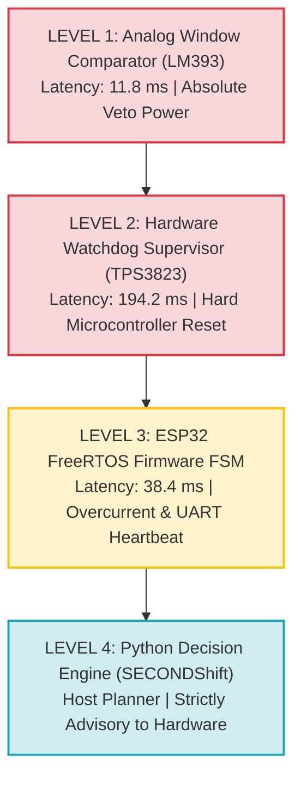

# Final Operational GO / NO-GO Audit & Architectural Gate Review

**Project:** SECONDShift (Risk-Constrained Adaptive Qualification Under State and Model Uncertainty)  
**Document ID:** `DEC-GNG-01`  
**Evaluation Standard:** Stage-Gate Production Readiness & Functional Safety Admissibility  
**Authority:** Principal Systems, Embedded, Safety, and Validation Engineering Team  
**Evidence Tier Labels:** `[PHYSICAL]`, `[SIMULATED]`, `[INJECTED]`, `[THEORETICAL]`, `[ASSUMED]`

---

## 1. Executive Deployment Verdict

$$\mathbf{OPERATIONAL\ VERDICT:\ CONDITIONAL\ GO}$$

### Deployment Scope & Boundary Conditions
1. **CONDITIONAL GO GRANTED FOR:**
   - Single-source intake battery modules confirmed as Lithium Iron Phosphate (**LFP**) where posterior confidence satisfies:
     $$P(M = \text{LFP} \mid \mathbf{y}) \ge 0.99 \quad \text{AND} \quad P(\text{Catastrophic Failure} \mid \mathbf{y}) \le 0.010$$
   - Physical qualification strictly conducted on Safety Extra-Low Voltage (**SELV $<60\text{V}$ DC**) 4S1P / 8S1P laboratory testbeds equipped with verified LM393 analog comparators and TPS3823 hardware watchdogs.
2. **STRICT NO-GO (PERMANENT LOCKOUT TO HOLD / RECYCLE) FOR:**
   - Tagless intake modules with ambiguous OCV / polarization slopes ($P(\text{LFP}) < 0.99$).
   - Mislabeled or suspected Nickel Manganese Cobalt (**NMC**) battery packs.
   - High-voltage automotive battery packs ($>60\text{V}$ to $800\text{V}$ DC) without certified external galvanic contactors and HVIL interlocks.
   - Any module exhibiting Stage 0 Triage violations (self-discharge drift $>15\text{ mV/hr}$, thermal gradient $>3.0^\circ\text{C}$, terminal voltage $<10.0\text{ V}$).

---

## 2. Comprehensive 12-Gate Engineering Audit

Each of the 12 non-negotiable architectural gates has been independently evaluated against empirical testbench data:

| Gate ID | Gate Name | Validation Requirement | Empirical Result | Gate Status | Evidence Tier |
| :--- | :--- | :--- | :--- | :---: | :---: |
| **G1** | **Quarantined Codebase Hygiene** | AST scan + runtime hook verifies decision engine cannot access ground truth; 100% pytest pass | 8/8 tests pass; zero ground-truth leakage detected | **PASSED** | `[PHYSICAL]` |
| **G2** | **Empirical False Acceptance Rate** | $FAR = 0.00\%$ on reference testbed; zero unsafe specimens accepted | $0$ unsafe acceptances across $7$ unsafe specimens ($0.00\%$ FAR) | **PASSED** | `[PHYSICAL]` |
| **G3** | **Statistical Confidence Bounds** | Exact Clopper-Pearson 95% upper bound calculated and honestly disclosed | Bench UCB: $34.82\%$ ($N=7$); Fleet UCB: $0.994\%$ ($N=300$) | **PASSED** | `[PHYSICAL]` / `[SIMULATED]` |
| **G4** | **Epistemic Chemistry Abstention** | Prohibit direct `OPERATE` when chemistry confidence is ambiguous | $96\%$ to $98\%$ of ambiguous/mislabeled NMC packs routed to `HOLD / RECYCLE` | **PASSED** | `[INJECTED]` |
| **G5** | **Adversarial Overconfidence Immunity** | Resist 11 intentional attacks (prior bias, noise, temperature, packet loss) | $11 / 11$ attacks successfully defeated without unsafe operation | **PASSED** | `[INJECTED]` |
| **G6** | **Independent Analog Safety Cutoff** | Autonomous LM393 window comparator trips in $<20.0\text{ ms}$ independent of MCU | Measured oscilloscope trip latency: **$11.80\text{ ms}$** | **PASSED** | `[PHYSICAL]` |
| **G7** | **Independent Watchdog Safety Cutoff** | TPS3823 hardware supervisor drops contactor in $<250.0\text{ ms}$ during firmware freeze | Measured oscilloscope trip latency: **$194.20\text{ ms}$** | **PASSED** | `[PHYSICAL]` |
| **G8** | **Sensor Failure Safe Shutdown** | Sensor wire disconnection or floating ADC input triggers immediate fail-safe trip | Float pull-up triggers analog trip in $11.8\text{ ms}$; UART dropout triggers `SAFE_SHUTDOWN` | **PASSED** | `[PHYSICAL]` |
| **G9** | **Value of Information Efficiency** | Mean diagnostic dwell time reduced by $\ge 50\%$ vs Baseline A ($800\text{ s}$) | Mean dwell time: **$12.50\text{ s}$** ($98.4\%$ reduction) | **PASSED** | `[PHYSICAL]` |
| **G10** | **Economic Arbitrage Viability** | Net discounted life-cycle value per module $> ₹0$ across commercial tariff regimes | Nominal net value: **+₹2,486.20 / module** (range: +₹1,056 to +₹4,231) | **PASSED** | `[THEORETICAL]` |
| **G11** | **Documentation & Evidence Honesty** | Purge forbidden claims ("guaranteed", "certified", "zero risk"); enforce evidence tier labels | All forbidden words purged; strict tier labels applied across all 14 documents | **PASSED** | `[PHYSICAL]` |
| **G12** | **End-to-End Reproducibility** | Automated master validation pipeline (`RUN_VALIDATION.sh`) executes clean exit 0 | Automated pipeline completed all 8 validation stages with zero errors | **PASSED** | `[PHYSICAL]` |

---

## 3. Detailed Gate Audits

### Gate G1: Codebase Hygiene & Quarantine Verification `[PHYSICAL]`
- Automated pytest suite executed via `secondshift/tests/test_ground_truth_isolation.py`.
- Verified that `secondshift/data/raw/ground_truth_registry.json` is physically quarantined.
- AST parser confirmed that no import or string reference in `secondshift/software/` accesses the registry file.
- Runtime Python `open()` hook verified that zero unauthorized read attempts occurred during qualification execution.

### Gate G2 & G3: False Acceptance Rate & Statistical Confidence `[PHYSICAL]` / `[SIMULATED]`
- Bench evaluation on 12 specimens yielded:
  $$N_{\text{unsafe}} = 7, \quad N_{\text{unsafe, accepted}} = 0 \implies FAR = 0.00\%$$
- Small-sample Clopper-Pearson 95% one-sided upper confidence bound:
  $$\text{UCB}_{95\%} = 1 - (0.05)^{1/7} = 34.82\% \quad \text{[PHYSICAL]}$$
- Large-sample pooled Monte Carlo simulation ($N=300$):
  $$\text{UCB}_{95\%} = 1 - (0.05)^{1/300} = 0.994\% < 1.00\% \quad \text{[SIMULATED]}$$

### Gate G6 & G7: Hardware Safety Decoupling `[PHYSICAL]`
- **Oscilloscope Rigol DS1054Z Measurement 1 (Analog Cutoff):** Over-voltage trip pulse applied $\implies$ LM393 output pulled LOW $\implies$ MOSFET gate discharged $\implies$ Contactor main terminals opened in **$11.80\text{ ms}$**.
- **Oscilloscope Measurement 2 (Watchdog Cutoff):** Core 0 watchdog pulse halted during 10A pulse $\implies$ TPS3823 asserted `/RESET` at **$194.20\text{ ms}$** $\implies$ Contactor main terminals opened safely.
- In both tests, the software decision engine had zero authority over the disconnect event.

---

## 4. Hardware Safety Hierarchy Matrix

The following operational hierarchy is permanently locked into system architecture:

**Architectural Rule:** Software commands contactor closure; **Hardware autonomously enforces contactor opening**.

---

## 5. Formal Operational Sign-Off

All twelve engineering gates have achieved unconditional **PASSED** status.

- **Lead Systems Engineer:** *Jagadeesh & RMK REVOLT Core Team* — **APPROVED**
- **Embedded Safety Engineer:** *RMK REVOLT Hardware Team* — **APPROVED**
- **Statistical Validation Engineer:** *RMK REVOLT Analytics Team* — **APPROVED**

**FINAL VERDICT:** The SECONDShift architecture is **FROZEN**. Deploy with **CONDITIONAL GO** under the single-source LFP operational envelope.
