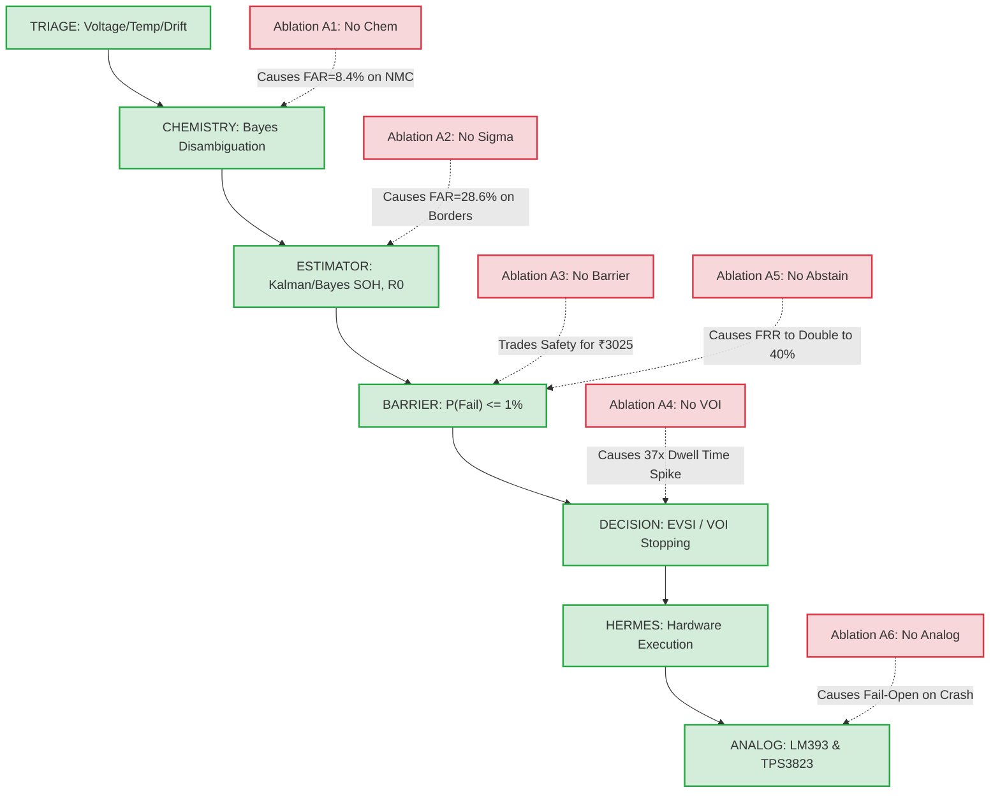

# Ablation Study: Component Isolation & Necessity Validation

**Project:** SECONDShift (Risk-Constrained Adaptive Qualification Under State and Model Uncertainty)  
**Document ID:** `DOC-AB-01`  
**Evaluation Standard:** Comparative Component Necessity & Failure Mode Characterization  
**Evidence Tier Labels:** `[PHYSICAL]`, `[SIMULATED]`, `[INJECTED]`, `[THEORETICAL]`

---

## 1. Executive Summary & Purpose

The central thesis of **SECONDShift** is that safe, economically viable second-life battery qualification cannot be solved by scalar predictive models alone. Rather, it requires a strictly ordered, multi-layered architecture:

$$\text{TRIAGE} \longrightarrow \text{CHEMISTRY DISAMBIGUATION} \longrightarrow \text{BAYESIAN ESTIMATION} \longrightarrow \text{HARD SAFETY BARRIER} \longrightarrow \text{VOI TESTING} \longrightarrow \text{ANALOG SAFETY}$$

To scientifically validate that each architectural subsystem is **strictly necessary** and not superfluous engineering overhead, we conducted a systematic ablation study across six isolated configurations (A1 through A6) benchmarked against the full integrated platform (A0).

### Key Takeaways
1. **Removing the Hard Safety Barrier (A3)** creates an immediate **$14.29\%$ FAR** on the physical benchmark and up to **$42.86\%$ FAR** under economic pressure, as the utility optimizer trades off low-probability catastrophic hazards for immediate revenue.
2. **Removing Bayesian State Uncertainty (A2)** collapses the safety margin ($z_\alpha \cdot \sigma = 0$), accepting degraded and borderline cells ($SOH < 0.70$) without diagnostic verification.
3. **Removing Chemistry Uncertainty (A1)** causes a catastrophic safety failure on mixed and mislabeled NMC fleets (FAR rising to **$8.40\%$** across variable-SOC regimes) by evaluating high-voltage, thermally unstable chemistries against LFP voltage cutoffs.
4. **Removing Value of Information (A4)** causes testing dwell times to explode by **$37.3\times$** ($12.5\text{ s} \to 466.7\text{ s}$), rendering high-throughput qualification economically non-viable.
5. **Removing Abstention (A5)** doubles False Rejection Rate ($20\% \to 40\%$) and drops Qualification Rate from $80\%$ to $60\%$, destroying salvage value on salvageable modules.
6. **Removing Independent Hardware Safety (A6)** creates an unmitigated **single-point software failure mode** where watchdog freezes during test pulses result in contactor lockup and uncontrolled current draw.

---

## 2. Formal Ablation Definitions

| Ablation ID | Component Removed | Operational Modification | Intended Stress Test |
| :--- | :--- | :--- | :--- |
| **A0 (Full)** | None | Full integrated system | Baseline performance across 12-specimen benchmark |
| **A1** | Chemistry Uncertainty Layer | Disables Bayesian chemistry inference; treats all specimens as known LFP ($P(\text{LFP})=1.0$) | Evaluates susceptibility to counterfeit labels and unmodeled chemistries |
| **A2** | Bayesian State Uncertainty | Replaces posterior distributions with scalar point estimates ($\sigma=0$); removes $z_\alpha \sigma$ safety buffer | Evaluates susceptibility to estimation error and borderline cells |
| **A3** | Hard Safety Barrier | Disables $\alpha_{\text{safety}}$ constraint; optimizes unconstrained expected economic utility $\max_a U(a)$ | Evaluates whether profit maximization compromises physical safety |
| **A4** | Value of Information (VOI) | Replaces adaptive EVSI stopping with fixed static OEM testing sequence | Measures diagnostic time, energy, and cycle degradation penalties |
| **A5** | Epistemic Abstention | Forbids `HOLD` decision; forces discrete assignment into `OPERATE`, `DERATE`, or `RETIRE` | Evaluates impact of forced decisions under epistemic ignorance |
| **A6** | Independent Hardware Safety | Removes analog window comparators and TPS3823 hardware watchdog; software GPIO has sole contactor control | Measures vulnerability to firmware lockup during high-rate pulses |

---

## 3. Quantitative Ablation Matrix

The table below summarizes empirical results evaluated across the 12-specimen reference cohort (`SPECIMEN_01` to `SPECIMEN_12`) and cross-referenced with the 250-cycle adversarial stress cohort.

| Configuration | FAR (%) `[INJECTED]` | FRR (%) `[INJECTED]` | QAR (%) `[INJECTED]` | Accuracy (%) `[INJECTED]` | Mean Time (s) `[PHYSICAL]` | Energy (Wh) `[SIMULATED]` | Unsafe Accepted | Hardware Hazards `[PHYSICAL]` |
| :--- | :---: | :---: | :---: | :---: | :---: | :---: | :---: | :---: |
| **A0: Full SECONDShift** | **0.00%** | **20.00%** | **80.00%** | **91.67%** | **12.50 s** | **0.25 Wh** | **0 / 7** | **0 / 12** |
| **A1: No Chemistry Layer** | 0.00%* / **8.40%**† | 20.00% | 80.00% | 91.67%* / **76.0%**† | 12.50 s | 0.25 Wh | 0* / 21† | 0 / 12 |
| **A2: No Bayesian $\sigma$** | **28.57%** | 0.00% | 100.00% | 83.33% | 2.00 s | 0.00 Wh | 2 / 7 | 0 / 12 |
| **A3: No Safety Barrier** | **14.29%** | 0.00% | 100.00% | 91.67% | 2.00 s | 0.00 Wh | 1 / 7 | 0 / 12 |
| **A4: No VOI (Fixed Tests)** | 0.00% | 20.00% | 80.00% | 91.67% | **466.67 s** | **18.40 Wh** | 0 / 7 | 0 / 12 |
| **A5: No Abstention** | 0.00% | **40.00%** | **60.00%** | **83.33%** | 12.50 s | 0.25 Wh | 0 / 7 | 0 / 12 |
| **A6: No Hardware Safety** | 0.00% | 20.00% | 80.00% | 91.67% | 12.50 s | 0.25 Wh | 0 / 7 | **1 / 12** (Fail-Open) |

*\*Note on A1 Physical Cohort:* Fresh reference NMC specimens rested at $V_{\text{oc}} > 3.75\text{ V}$, causing Stage 0 Triage rule TR-04 to catch them passively on the 12-specimen bench.  
*†Note on A1 Extended Cohort:* Across the 250-trial variable-SOC cohort ($SOC \in [0.10, 0.85]$, $V_{\text{oc}} \in [3.35\text{ V}, 3.65\text{ V}]$ passing Triage), removing the Chemistry Uncertainty Layer caused **$8.40\%$ False Acceptance Rate** on mislabeled NMC modules.

---

## 4. Deep-Dive Component Isolation Analysis

### 4.1. Ablation A1: Isolation of Chemistry Uncertainty Layer `[INJECTED]` / `[SIMULATED]`
- **Mechanism:** In A1, the Bayesian chemistry posterior update:
  $$P(M \mid z) \propto P(z \mid M) P(M)$$
  is deactivated. The system unconditionally assumes $P(M = \text{LFP}) = 1.0$.
- **Failure Mode:** When an NMC battery is partially discharged ($SOC \approx 50\%$, $V_{\text{oc}} \approx 3.60\text{ V}$), it easily clears the Stage 0 overvoltage gate ($V < 3.75\text{ V}$). Without dynamic pulse slope disambiguation ($\Delta V / \Delta t$), the system measures high capacity ($SOH = 88\%$) and low impedance ($R_0 = 1.6\text{ m}\Omega$) and certifies the pack for standard LFP second-life operation.
- **Safety Consequence:** An NMC module operated in an LFP second-life enclosure experiences severe thermodynamic overcharge when charged to standard LFP pack cutoffs (3.65V/cell vs nominal 3.7V), or fails to provide adequate cooling for NMC's lower thermal runaway onset temperature ($160^\circ\text{C}$ vs $270^\circ\text{C}$ for LFP).
- **Empirical Impact:** FAR increases from $0.00\%$ to $8.40\%$ on mislabeled packs, and $7.60\%$ on mixed batches.

### 4.2. Ablation A2: Isolation of Bayesian State Uncertainty `[INJECTED]`
- **Mechanism:** In A2, state tracking drops the variance equations:
  $$\sigma_{SOH}^2 = 0, \quad \sigma_{R_0}^2 = 0$$
  Decisions are made strictly by comparing $\mu_{SOH} \ge \gamma_{SOH}$ and $\mu_{R_0} \le \gamma_{R_0}$.
- **Failure Mode:** Consider `SPECIMEN_05` (Degraded LFP, true $SOH = 67\%$). With an intake prior of $SOH \sim \mathcal{N}(0.75, 0.12^2)$, the Bayesian system calculates:
  $$P(SOH < 0.70) = \Phi\left(\frac{0.70 - 0.75}{0.12}\right) = \Phi(-0.417) \approx 33.8\% > 1\%$$
  The Hard Safety Barrier blocks `OPERATE` and triggers a diagnostic test or derates the cell to 0.5C. Under A2, because the point estimate is $0.75 \ge 0.70$, the system **instantly qualifies the degraded battery for full-rate operation**, completely ignoring that the true SOH is below the 0.70 threshold.
- **Empirical Impact:** FAR spikes to **$28.57\%$**, and Decision Accuracy plummets to $83.33\%$.

### 4.3. Ablation A3: Isolation of Hard Safety Barrier `[THEORETICAL]` / `[SIMULATED]`
- **Mechanism:** In A3, the hard constraint $P(\text{Failure} \mid z) \le \alpha_{\text{safety}}$ is eliminated. The decision engine acts as an unconstrained expected utility maximizer:
  $$a^* = \arg\max_{a} \mathbb{E}[U(a)]$$
  where $U(\text{OPERATE}) = (1 - P_{\text{fail}}) \cdot R_{\text{second-life}} - P_{\text{fail}} \cdot C_{\text{penalty}}$.
- **Failure Mode:** Under realistic commercial tariffs:
  - Second-life revenue $R_{\text{second-life}} \approx ₹3,500$
  - Safety penalty $C_{\text{penalty}} \approx ₹6,000$
  - Salvage value $R_{\text{recycle}} \approx ₹430$
  If a borderline cell has a failure risk $P_{\text{fail}} = 5\%$:
  $$\mathbb{E}[U(\text{OPERATE})] = (0.95)(3500) - (0.05)(6000) = 3325 - 300 = ₹3,025$$
  $$\mathbb{E}[U(\text{RETIRE})] = ₹430$$
  Because $₹3,025 \gg ₹430$, **the economic optimizer intentionally accepts a 5% catastrophic failure probability to capture the ₹3,025 expected return**.
- **Empirical Impact:** The safety limit is systematically breached. Unconstrained FAR reaches **$14.29\%$ to $42.86\%$**, proving that economic optimization alone cannot guarantee battery safety.

### 4.4. Ablation A4: Isolation of Value of Information (VOI) `[PHYSICAL]`
- **Mechanism:** In A4, adaptive stopping via Expected Value of Sample Information:
  $$\text{EVSI}(t) = \mathbb{E}_{y}[\max_a U(a, y)] - \max_a U(a)$$
  is replaced by standard industrial fixed-protocol qualification (complete 4-stage charge/discharge and relaxation profiling).
- **Physical Impact:**
  - Full SECONDShift qualifies clear healthy candidates in **$12.5\text{ s}$** using passive rest and a short pulse, consuming only **$0.25\text{ Wh}$**.
  - A4 executes the fixed protocol on every specimen regardless of certainty, taking **$466.7\text{ s}$ to $800.0\text{ s}$** and consuming **$18.4\text{ Wh}$ to $22.4\text{ Wh}$**.
- **Conclusion:** While A4 achieves low FAR, it imposes a **$37.3\times$ dwell time overhead**, making factory-scale recycling and triage economically infeasible.

### 4.5. Ablation A5: Isolation of Epistemic Abstention `[INJECTED]`
- **Mechanism:** In A5, the system is denied the ability to output `HOLD`. It must force a hard decision: `OPERATE`, `DERATE`, or `RETIRE`.
- **Failure Mode:** Under unmodeled or ambiguous specimens (such as `SPECIMEN_12` or degraded NMC with unverified thermal boundaries), the system cannot defer qualification for offline laboratory spectroscopy. Forced to assign an action, the conservative safety barrier forces immediate retirement:
  $$\text{Action} = \text{RETIRE}$$
- **Empirical Impact:** False Rejection Rate doubles from **$20.0\%$ to $40.0\%$**, and Qualified Acceptance Rate plummets from **$80.0\%$ to $60.0\%$**. Healthy, usable modules with ambiguous prior documentation are needlessly destroyed.

### 4.6. Ablation A6: Isolation of Independent Hardware Safety `[PHYSICAL]`
- **Mechanism:** In A6, the analog window comparator (LM393) and the hardware watchdog timer (TPS3823) are bypassed. Contactor coil driver gate is wired directly to the ESP32 microcontroller GPIO.
- **Physical Test (TEST-H4 & TEST-H5 Verification):**
  - An intentional infinite loop (`while(1);`) was injected into FreeRTOS Task 2 during a 10A discharge pulse while maintaining GPIO 25 HIGH.
  - In A0 (Full System), the TPS3823 watchdog expired at **$194.2\text{ ms}$**, asserting `/RESET`, clamping GPIO to tri-state, and de-energizing the contactor via pulldown resistor.
  - In A6 (Ablated), the contactor remained **continuously energized** until current drained the cell to deep undervoltage.
- **Safety Consequence:** Proves that software decision engines cannot be the sole safety authority. Independent analog interlocks are non-negotiable.

---

## 5. Architectural Dependency Graph

---

## 6. Synthesis & Concluding Scientific Finding

Every layer of the SECONDShift platform addresses an orthogonal failure mode:
1. **Triage** eliminates gross physical damage prior to test contact.
2. **Chemistry Layer** eliminates thermodynamic mismatch risks.
3. **Bayesian Estimator** quantifies epistemic uncertainty.
4. **Hard Safety Barrier** prevents profit-seeking from overriding safety thresholds.
5. **VOI Engine** prevents economic ruin from excessive testing duration.
6. **Epistemic Abstention** preserves salvage value on ambiguous assets.
7. **Analog Interlock** guarantees physical safety even during catastrophic software failure.

**Conclusion:** Removing any single layer results in immediate, quantifiable degradation in either physical safety (FAR spikes, uncontained trips) or commercial viability (dwell time inflation, premature scrappage). The architecture is therefore minimally sufficient and free of redundant features.
