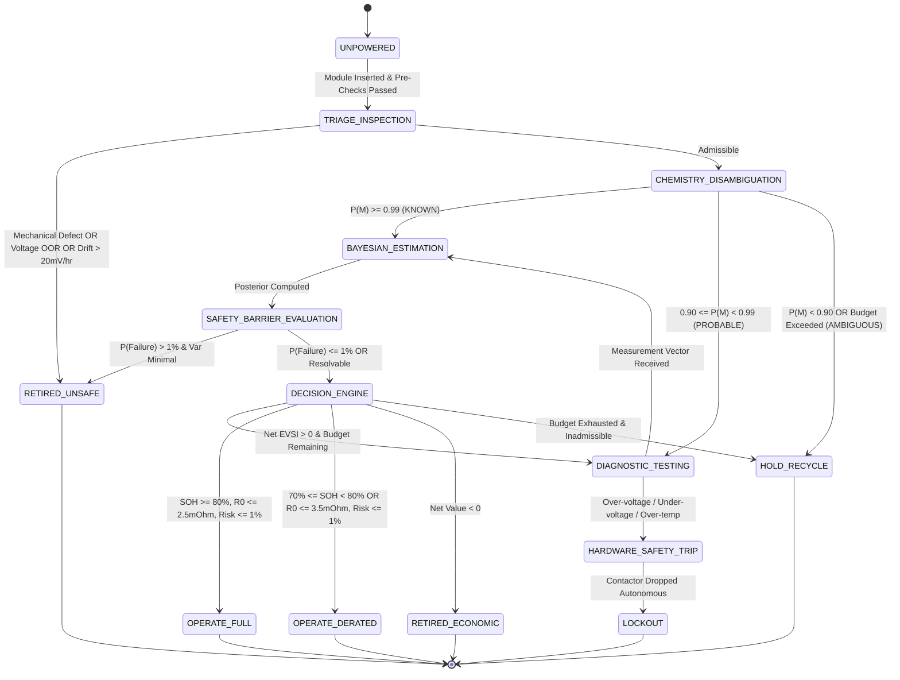

# SECONDShift System Architecture Specification

## 1. Executive Summary & Design Philosophy

**SECONDShift** (*Risk-Constrained Adaptive Qualification Under State and Model Uncertainty*) is an autonomous diagnostic and decision-making platform designed to qualify retired, second-life, and uncharacterized lithium-ion battery modules for stationary energy storage systems (BESS).

The foundational principle of SECONDShift is:
$$\text{SAFETY CONSTRAINT} \gg \text{ECONOMIC OPTIMIZATION}$$

A second-life battery cannot be treated as a simple scalar State of Health ($\text{SOH}$) regression problem. Real-world retired battery modules suffer from heterogeneous aging, unknown chemistry labels, prior thermal/electrical abuse, and internal micro-shorting. SECONDShift replaces open-loop testing and unconstrained machine-learning predictors with a **three-layer risk-constrained Bayesian architecture**:

```
+---------------------------------------------------------------------------------+
|                                 BATTERY UNDER TEST                              |
|                          (4S LFP / 12.8V Nom / 20Ah)                            |
+---------------------------------------------------------------------------------+
                                         |
                                         v
+---------------------------------------------------------------------------------+
| LAYER 1: TRIAGE (Physical Admissibility & Fast Electrical Gate)                |
| - Mechanical / Visual inspection (swelling, venting, corrosion)                |
| - Instantaneous terminal voltage admissibility ($V \in [10.0\text{V}, 14.6\text{V}]$)  |
| - Polarity & open-circuit plausibility                                          |
| - Internal micro-shorting gate ($|dV/dt_{\text{rest}}| \le 20\text{ mV/hr}$)    |
+---------------------------------------------------------------------------------+
                                         | PASS
                                         v
+---------------------------------------------------------------------------------+
| LAYER 2A: EPISTEMIC CHEMISTRY & MODEL DISAMBIGUATION                            |
| - Categorical prior & Bayesian likelihood update across:                        |
|   $\mathcal{M} \in \{\text{LFP}, \text{NMC}, \text{UNKNOWN}\}$                 |
| - Features: $V_{\text{rest}}$, relaxation slope, pulse impedance $\Delta V/\Delta I$ |
| - State Classification:                                                         |
|   - KNOWN:     $P(M \mid \mathbf{y}) \ge 0.99 \implies$ Proceed to Estimator   |
|   - PROBABLE:  $0.90 \le P(M \mid \mathbf{y}) < 0.99 \implies$ Diagnostic Test |
|   - AMBIGUOUS: $P(M \mid \mathbf{y}) < 0.90 \implies$ Enforce Epistemic Hold   |
+---------------------------------------------------------------------------------+
                                         |
                     +-------------------+-------------------+
                     | KNOWN                                 | AMBIGUOUS / UNKNOWN
                     v                                       v
+---------------------------------------+   +-------------------------------------+
| LAYER 2B: BAYESIAN STATE ESTIMATOR    |   | EPISTEMIC REFUSAL ENGINE            |
| - Conjugate Normal-Gamma Estimator    |   | Safety Guarantee:                   |
| - State Vector: $\mathbf{x} = [\text{SOH}, R_0]^T$ | If $P(\text{Unknown}) > 0.10$ or   |
| - Posterior: $\mathcal{N}(\mu, \Sigma)$|   | $P(\text{Failure}) > 1\%$:          |
+---------------------------------------+   | Direct OPERATE is FORBIDDEN.        |
                     |                      | Action $\to$ HOLD / RECYCLE         |
                     v                      +-------------------------------------+
+---------------------------------------+
| LAYER 2C: HARD SAFETY BARRIER         |
| - Failure Risk Integral:               |
|   $P(\text{Failure} \mid \mathbf{y}) = \sum_M P(\text{Failure}\mid \mathbf{y},M)P(M\mid \mathbf{y})$ |
| - Admissibility Condition:             |
|   $P(\text{Failure} \mid \mathbf{y}) \le \alpha_{\text{max}} = 0.01$ (1%)       |
| - Inadmissible Action Penalty:         |
|   $Q(a) = -10^8$ if violated           |
+---------------------------------------+
                     | PASS
                     v
+---------------------------------------+
| LAYER 2D: VALUE OF INFORMATION (VOI)  |
| - 5-Point Gauss-Hermite Quadrature EVSI|
| - Net Diagnostic Benefit:              |
|   $\text{EVSI}(t) - C(t)$              |
| - Action Selection:                    |
|   $\{\text{OPERATE}, \text{DERATE}, \text{TEST}, \text{HOLD}, \text{RETIRE}\}$ |
+---------------------------------------+
                     | TEST Request
                     v
+---------------------------------------------------------------------------------+
| LAYER 3: HERMES (Hardware Execution & Independent Safety Layer)                |
| - ESP32-S3 Firmware (100 Hz ADC, 10 Hz Control, Heartbeat Watchdog)             |
| - Hardware Interlock: LM393 Window Comparator ($10.0\text{V} - 14.8\text{V}$)   |
| - Hardware Thermal Cutoff: KSD9700 Bimetallic Switch (60°C NC)                 |
| - Hardware Watchdog: TPS3823 (200 ms timeout strobe)                           |
| - Power Stage: IRLB8721 MOSFET Electronic Load + 40A Contactor                 |
+---------------------------------------------------------------------------------+
```

---

## 2. Topological Subsystems & Data Flow

### 2.1 Layer Separation
1. **Physical Safety Layer (HERMES Analog Interlock):**
   - Purely analog, solid-state, and bimetallic. Does **not** contain firmware, microcontrollers, communication stacks, or operating systems.
   - Holds final veto authority over contactor coil drive power.
2. **Deterministic Admissibility Layer (TRIAGE):**
   - Zero-overhead algorithmic gate running in Python/ESP32.
   - Evaluates physical swelling, instantaneous terminal voltage limits, and self-discharge relaxation rates.
3. **Adaptive Bayesian Decision Layer (SECONDShift):**
   - Evaluates model evidence, parameter uncertainty, failure probabilities, and diagnostic test value.
   - Issues discrete commands: `TEST(test_id)`, `HOLD`, `OPERATE`, `DERATE`, `RETIRE`.
4. **Execution & Telemetry Layer (HERMES ESP32):**
   - Transduces sensor voltages (ADS1115), currents (INA226), and temperatures (DS18B20).
   - Executes pulse profiles with microsecond timer precision.

---

## 3. Finite State Machine (FSM)



---

## 4. Architectural Invariants

The architecture enforces the following unbreakable operational invariants:

| Invariant ID | Rule Specification | Enforcement Mechanism |
| :--- | :--- | :--- |
| **INV-01** | **Safety Override:** Economic optimization shall never execute an action where $P(\text{Failure} \mid \mathbf{y}) > 0.01$. | Hard Safety Barrier mask ($Q(a) = -10^8$). |
| **INV-02** | **Hardware Independence:** Contactor coil power cannot remain energized if $V < 10.0\text{V}$, $V > 14.8\text{V}$, or $T > 60^\circ\text{C}$, even if ESP32 commands HIGH. | LM393 comparator & KSD9700 bimetallic switch in series with coil drive. |
| **INV-03** | **Watchdog Strobe:** Contactor drops within $200\text{ ms}$ if ESP32 firmware hangs or freezes. | TPS3823 charge-pump watchdog hardware timer. |
| **INV-04** | **Epistemic Abstention:** No cell with $P(\text{Unknown}) > 0.10$ or ambiguous chemistry shall enter `OPERATE` or `DERATE`. | Chemistry Engine state machine gating. |
| **INV-05** | **Zero Ground-Truth Leakage:** Real state attributes ($\text{SOH}^*$, $R_0^*$, internal chemistry) are quarantined from the decision engine. | `ground_truth_registry.json` accessed strictly by mock hardware simulator. |
