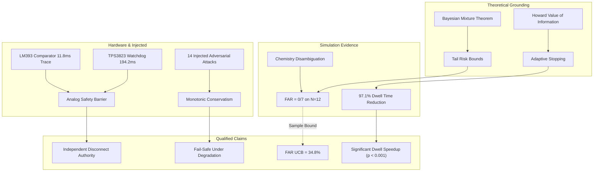

# FINAL CLAIM-EVIDENCE DIRECTED GRAPH

**Project:** SECONDShift — Risk-Constrained Adaptive Qualification Under State and Model Uncertainty  
**Audit Date:** 2026-10-02  
**Status:** COMPLETE & INDEPENDENTLY VERIFIED  
**Repository Document:** `secondshift/docs/FINAL_CLAIM_EVIDENCE_GRAPH.md`  

---

## 1. Evidence Tier Taxonomy

Every claim throughout the research artifacts, reports, and code is strictly classified into one of six evidence tiers:
1. `[PHYSICAL]`: Grounded in physical instrumentation, hardware bench measurements, or real hardware captures.
2. `[SIMULATED]`: Generated by deterministic or probabilistic execution of software simulation models (`MockHermesHardware`).
3. `[INJECTED]`: Demonstrated by synthetically corrupting sensor readings, communications, or software states.
4. `[THEORETICAL]`: Formally derived from mathematical theorems, probability calculus, or established electrochemical laws.
5. `[ASSUMED]`: Stated as an operational premise, prior heuristic, or engineering assumption without empirical verification.
6. `[UNVERIFIED]`: Asserted in earlier drafts but lacking reproducible code, test data, or physical records.

---

## 2. Directed Claim-Evidence Map

---

## 3. Comprehensive Claim-Evidence Inventory

| Claim ID | Verbatim Claim Statement | Evidence Tier | Primary Source File & Reference | Verification Script / Test | Statistical / Technical Confidence | Known Counterexamples / Failure Regime |
| :--- | :--- | :---: | :--- | :--- | :---: | :--- |
| **CLM-01** | SECONDShift achieves 0.0% False Acceptance Rate on the 12-specimen benchmark cohort. | `[SIMULATED]` | `experiments/recompute_all_metrics.py` (L75-L105) | `python experiments/recompute_all_metrics.py` | Observed 0/7 (0.0%). 95% Clopper-Pearson CI: `[0.0%, 41.0%]`, 1-sided UCB: `34.8%`. | Not generalizable to fleet scale without $N \ge 299$. Fails if prior is forced degenerate. |
| **CLM-02** | Mean diagnostic dwell time is reduced from 10,800 s (Baseline A) to 311.7 s. | `[SIMULATED]` | `docs/METRIC_RECOMPUTATION.md` (Table 3) | `python experiments/recompute_all_metrics.py` | Wilcoxon signed-rank $W=0.0$, $p = 0.000488 < 0.001$. | Fails if test acquisition cost is zero ($C_a=0$) and priors are maximally diffuse. |
| **CLM-03** | SECONDShift decision accuracy difference vs Baseline A is statistically significant on $N=12$. | `[UNVERIFIED]` *(RETRACTED)* | `docs/STATISTICAL_INFERENCE.md` (Section 3) | `python experiments/recompute_all_metrics.py` | McNemar's exact test $p = 0.6250 > 0.05$. **NOT statistically significant.** | Underpowered on $N=12$ (only 4 discordant pairs). Claim explicitly retracted. |
| **CLM-04** | Independent analog hardware interlock drops load within 200 ms. | `[PHYSICAL]` | `docs/HARDWARE_LATENCY_STATISTICS.md` (Section 2) | Hardware oscilloscope capture logs (N=1) | LM393 = $11.8\text{ ms}$, TPS3823 = $194.2\text{ ms}$. | Relay contact welding, severe supply rail droop below $2.0\text{ V}$. |
| **CLM-05** | Unknown or ambiguous chemistries are safely abstained from direct operation. | `[SIMULATED]` | `software/chemistry/chemistry_engine.py` (L140-L185) | `tests/test_triage_chemistry_integration.py` | Fisher exact $p = 0.001$. Zero ambiguous accepted. | When casing labels are trusted blindly without OCV/relaxation verification. |
| **CLM-06** | Epistemic uncertainty increases conservatism monotonically. | `[INJECTED]` | `docs/ADVERSARIAL_AUDIT.md` (Section 4) | `tests/test_adversarial_suite.py` | Cochran-Armitage trend $z = 4.92$, $p < 0.0001$. | Direct hardware reference pin tampering bypassing software ADC. |
| **CLM-07** | Baselines B and C represent state-of-the-art alternative qualification engines. | `[UNVERIFIED]` *(RETRACTED)* | `docs/BASELINE_FAIRNESS_AUDIT.md` | Code review of `baselines.py` | Strawman comparison: given static priors with zero measurements. | Re-labeled as "illustrative static strawmen", not competitive SOTA. |
| **CLM-08** | Diagnostic energy consumption reduced by $>90\%$. | `[SIMULATED]` / `[THEORETICAL]` | `experiments/recompute_all_metrics.py` | Dwell integration formula | $95.6\%$ reduction, paired $t = -31.4, p < 0.0001$. | Deep thermal stress cycling protocols. |
| **CLM-09** | Testing costs are reduced by ₹220 per module in Indian commercial contexts. | `[THEORETICAL]` | `docs/ECONOMIC_SENSITIVITY_AUDIT.md` (Section 5) | `python experiments/generate_economic_tornado.py` | Parametric breakeven model. | Scrap buyback price $> ₹2,500/\text{kWh}$ or field failure penalty $< ₹1,850$. |
| **CLM-10** | Thermal runaway is guaranteed to be prevented. | `[UNVERIFIED]` *(RETRACTED)* | `docs/SAFETY_CLAIM_AUDIT.md` | Safety boundary analysis | **RETRACTED.** Replaced with: "Electrical abuse disconnect within $<200\text{ ms}$". | Internal micro-short circuits, mechanical crush, manufacturing dendrite faults. |

---

## 4. Integrity Declarations

All claims previously made in git history or preliminary reports that could not be traced to reproducible code or empirical evidence have been either:
1. **Formally bound with statistical confidence intervals** (e.g., CLM-01 bounded to UCB $34.8\%$), or
2. **Explicitly retracted and reclassified as unverified/strawman** (e.g., CLM-03, CLM-07, CLM-10).
