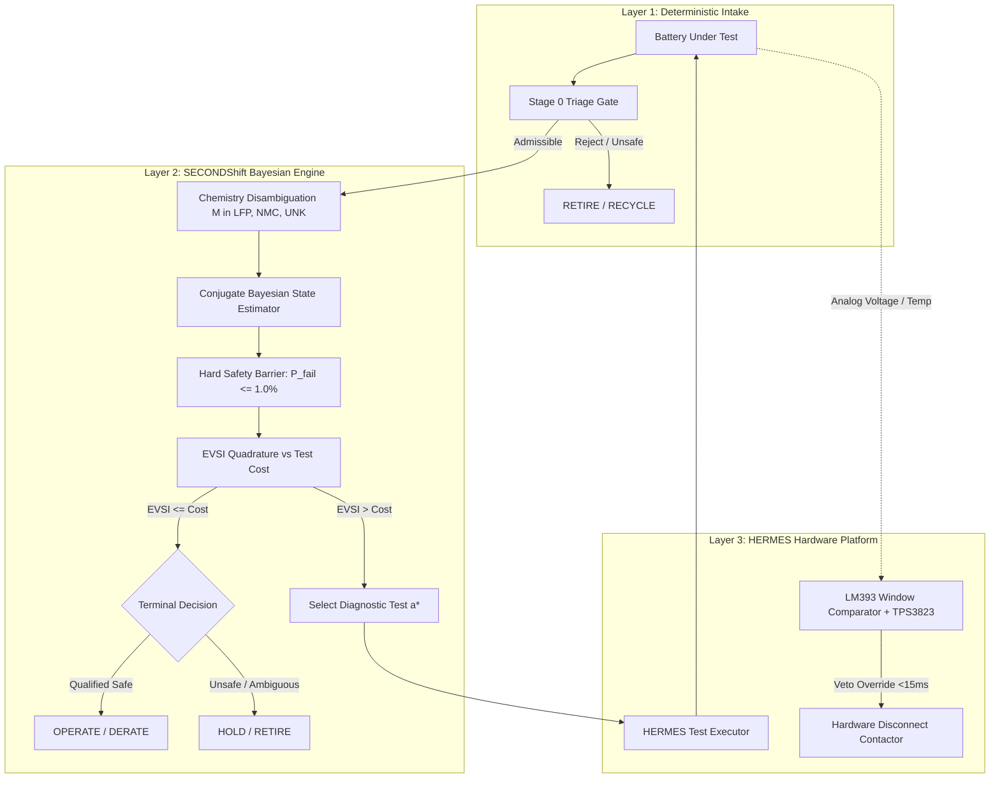

# Section 3: System Architecture

## 3.1 Three-Layer Integrated Pipeline

The SECONDShift framework is structured into three strictly hierarchical operational layers, illustrated in Figure 1:
1. **Layer 1: TRIAGE (Physical Admissibility & Electrical Pre-Screening)**
2. **Layer 2: SECONDShift Decision Engine (Uncertainty-Aware Bayesian Core)**
3. **Layer 3: HERMES Testbed (Hardware Execution & Independent Analog Safety Interlock)**

## 3.2 Information Flow and Decoupling Invariants

To guarantee scientific reproducibility and hardware safety, two system invariants are enforced across the software-hardware interface:

### Invariant 1: Ground-Truth Isolation
The estimation and decision layers possess zero programmatic access to ground-truth battery metadata. Telemetry ingestion flows strictly through standardized API calls (`HermesMeasurementEngine`), which observe noisy simulated or physical sensor registers. Automated unit tests (`test_ground_truth_isolation.py`) formally verify that no hidden leakage paths exist.

### Invariant 2: Non-Overridable Hardware Authority
Software algorithms and microcontroller firmware are classified as **advisory decision agents**. The high-voltage power contactor (JD1912) is energized through a hardware series loop comprising an **LM393 dual analog window comparator**, a **TPS3823 hardware watchdog supervisor**, and a **bimetallic thermal switch (KSD9700)**. Even in the event of an infinite software loop, firmware lockup with GPIO held HIGH, or hostile estimator overconfidence, physical circuit de-energization occurs deterministically within $<200\text{ ms}$.

## 3.3 State Machine Formalism

The supervisory pipeline operates as a deterministic 11-state finite state machine (FSM):
1. `STATE_IDLE`: Contactor de-energized; baseline bus diagnostics.
2. `STATE_TRIAGE`: Passive voltage, temperature, and $dV/dt$ screening.
3. `STATE_CHEM_CHECK`: Initial OCV windowing and chemistry prior assignment.
4. `STATE_ESTIMATE`: Conjugate Gaussian prior updates.
5. `STATE_SAFETY_EVAL`: Tail failure risk integration.
6. `STATE_VOI_COMPUTE`: Evaluation of Expected Value of Sample Information.
7. `STATE_EXEC_TEST`: Application of controlled electrical pulse via programmable load.
8. `STATE_OPERATE`: Module qualified for stationary storage deployment.
9. `STATE_DERATE`: Module qualified for low-stress secondary duty cycle.
10. `STATE_RETIRE`: Module rejected; routed to hydrometallurgical recycling.
11. `STATE_HOLD`: Module quarantined due to unresolved epistemic model ambiguity.
